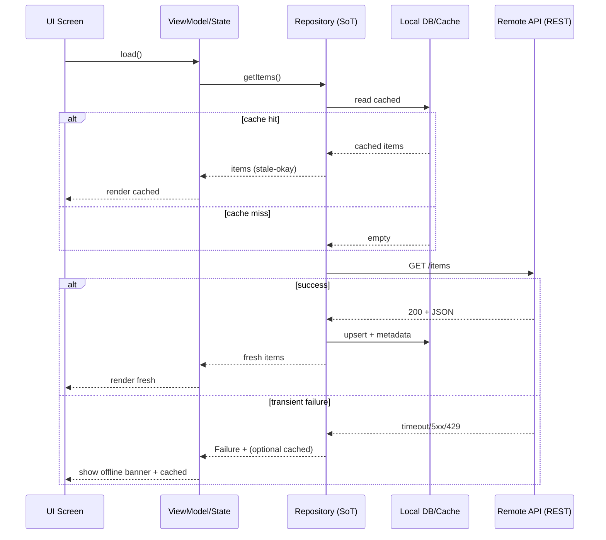

# Kiến trúc và thực hành tốt nhất để xây dựng Flutter production-ready đa nền tảng năm 2026

## Tóm tắt điều hành

Báo cáo này đề xuất một “blueprint” codebase Flutter **production-ready, chuẩn hoá, dễ mở rộng** cho **iOS/Android/web**, tích hợp **RESTful JSON API** và vận hành song song (hoặc tích hợp) với **React/Next.js**. Các giả định của bạn (đa nền tảng; backend REST JSON; CI provider chưa xác định) được giữ nguyên; mọi chi tiết cần quyết định thêm (ví dụ: chuẩn token, refresh endpoint, chiến lược đồng bộ offline) sẽ được ghi rõ là **chưa xác định**. citeturn28view0turn25view1turn19search6

Khuyến nghị “mặc định để bắt đầu dự án mới (2026)” là:

- **Kiến trúc**: phân lớp rõ **UI layer** và **Data layer**, áp dụng **Repository pattern**, và trong UI dùng phong cách **MVVM (ViewModel + View)** để tránh nhét logic vào widget; đây là các khuyến nghị chính thức của Flutter cho app có khả năng scale. citeturn28view0turn25view1  
- **State management + DI**: ưu tiên **Riverpod 2.x** như “state + dependency graph” vì dễ test, tách khỏi `BuildContext`, hỗ trợ tự huỷ (auto-dispose) và patterns async tốt (đặc biệt cho REST). (Flutter docs vẫn “recommend Provider” cho DI; Riverpod thường được chọn trong dự án lớn để gom state+DI vào một hệ thống nhất quán.) citeturn28view0turn1search0turn5search17  
- **Routing**: mặc định dùng **go_router** (được Flutter docs khuyến nghị cho phần lớn ứng dụng) vì bám Router API, hỗ trợ deep link, redirect/guards; **auto_route** là lựa chọn mạnh khi bạn cần **route typed/codegen** và muốn tối ưu boilerplate định tuyến. citeturn28view0turn10search3turn10search0  
- **Networking**: dùng **Dio** (interceptors, cancel, timeout, adapters…) + (tuỳ nhu cầu) **retrofit.dart** để codegen client typed “retrofit-like”. Các yêu cầu retry/backoff nên tuân theo **exponential backoff + jitter** và tôn trọng `Retry-After`. citeturn3search0turn3search2turn4search0turn4search10  
- **Model/codegen**: ưu tiên **Freezed + json_serializable** cho model immutable, union/sealed và JSON ser/de; `build_runner` là nền tảng chạy generator. **built_value** phù hợp khi bạn thích builder/serializer chặt chẽ hơn, nhưng thường nặng hơn về ceremony. citeturn9search0turn9search1turn9search2turn9search15  
- **Offline-first & cache**: áp dụng offline-first theo hướng dẫn Flutter: repository là “single source of truth”, phối hợp remote (REST) + local (SQLite/NoSQL), có chiến lược sync rõ. Về storage: **Drift (SQLite)** cho dữ liệu quan hệ/complex (và có hướng đa nền tảng), **Hive** cho KV nhanh, **Sembast** cho document store trong 1 file. citeturn25view1turn7search0turn7search2turn7search3  
- **Bảo mật**: tuân theo **OWASP MASVS** (chuẩn công nghiệp cho mobile) và best current practice OAuth cho native apps (**RFC 8252**) + PKCE (**RFC 7636**) nếu bạn dùng OAuth/OIDC. Lưu token nhạy cảm qua **flutter_secure_storage** (Keychain iOS + Encrypted Shared Preferences Android). citeturn6search1turn6search2turn6search3turn6search0  
- **Tích hợp React/Next.js**: chuẩn hoá **API contract** bằng **OpenAPI 3.1**, sinh SDK cho Dart/Flutter và TS/Next để giảm lệch model; nếu cần nhúng Flutter web vào app React/Next, tham khảo mẫu chính thức **web_embedding** (embed Flutter “không cần iframe”) và các community ports cho React. citeturn19search3turn19search1turn27view0  

Các template/open-source codebase nên cân nhắc (6–10 dự án) chỉ để **bootstrapping** và “soi” cách tổ chức production gồm: **Compass app (Flutter official sample)**, **Very Good Core/Templates**, **flutter_riverpod_clean_architecture**, **Stacked**, **flutter_clean_starter**, **Cinnamon riverpod template**, **flutter/samples (web_embedding, navigation_and_routing)**, **flutter-folio**, và **flutter_architecture_samples** (mang tính học thuật, không phải starter). citeturn29view0turn24search3turn20search2turn20search1turn23search0turn23search1turn27view0turn22search1turn20search3  

## Kiến trúc mục tiêu và cấu trúc dự án

Flutter đã công khai bộ “Architecture recommendations” với các ý cốt lõi: tách **UI layer** và **Data layer**, dùng **Repository pattern** ở data layer, UI theo **ViewModel + View (MVVM)** để widget “dumb”, tránh logic trong widget, và ưu tiên model immutable (có thể dùng Freezed/built_value). citeturn28view0turn25view1

### Blueprint kiến trúc đề xuất

- **Presentation (UI)**: Widgets/Screens chỉ render và dispatch event; trạng thái nằm ở **ViewModel/Controller** (Riverpod Notifier/AsyncNotifier hoặc Bloc/Cubit).
- **Domain**: entity, use-cases (tuỳ mức “Clean Architecture” bạn muốn), error types ở mức nghiệp vụ.
- **Data**: repository implementation, remote datasource (Dio/http clients), local datasource (Drift/Hive/Sembast), mappers.
- **Core**: cross-cutting concerns (logging, config, auth session, error mapping, analytics, DI bootstrap, routing root, theming, i18n).

Flutter nhấn mạnh repository là “single source of truth”; đặc biệt trong offline-first, repository kết hợp local+remote để cung cấp một điểm truy cập thống nhất, độc lập trạng thái mạng. citeturn25view1turn28view0

```mermaid
flowchart TB
  UI[UI: Screens / Widgets] -->|events| VM[ViewModel / State (Riverpod Notifier / BLoC)]
  VM --> UC[Optional Use-cases / Application Services]
  UC --> R[Repository Abstraction]
  R -->|read/write| Remote[Remote Data Source\nDio/http SDK]
  R -->|read/write| Local[Local Data Source\nDrift/Hive/Sembast]
  Remote --> API[(REST JSON API)]
  Local --> DB[(Local Storage)]
  VM --> Router[Routing\n(go_router / auto_route)]
  UI --> Theme[Theming + Design Tokens]
  UI --> I18n[Localization]
  UI --> A11y[Accessibility Semantics]
```

### Layout thư mục khuyến nghị

Flutter docs khuyến nghị đặt tên rõ theo “architectural component” (ví dụ `HomeViewModel`, `UserRepository`) và tránh tên directory dễ nhầm với Flutter SDK như `/widgets`; thay vào đó có thể dùng `ui/core/` cho shared UI. citeturn28view0

Một layout “feature-first + layers” thường cân bằng tốt giữa scale theo team và khả năng modular hoá sau này:

```text
lib/
  app/
    app.dart                 // root widget, theme, router, localization delegates
    bootstrap.dart           // init (DI, env, logging, error handlers)
  core/
    config/                  // env, flavors, build-time defines
    errors/                  // Failure, ApiException mapping, Result/Either
    network/                 // Dio client, interceptors, retry, cache
    auth/                    // session, token store, refresh coordinator
    storage/                 // db init, key-value store wrappers
    routing/                 // root router (go_router / auto_route)
    theme/                   // ThemeData + ThemeExtensions + tokens
    i18n/                    // l10n glue code if needed (gen_l10n outputs elsewhere)
    utils/                   // pure utils
  features/
    auth/
      data/
        datasources/
        models/
        repositories/
      domain/
        entities/
        usecases/
        repositories/
      presentation/
        state/               // Notifier/Cubit/BLoC
        screens/
        widgets/
    home/
      ...
  shared/
    ui/                      // reusable UI components (design system)
    assets/                  // strongly consider flutter_gen / conventions
main.dart                    // calls bootstrap -> app
```

Nếu bạn muốn “Clean Architecture chuẩn” hơn (domain thuần, data phụ thuộc domain, UI phụ thuộc domain), Flutter’s offline-first guide cũng gợi ý tách model remote/local/UI riêng khi dữ liệu phức tạp và để repository đảm nhiệm mapping. citeturn25view1turn28view0

### Modularization, monorepo và tổ chức package

Với đội nhóm lớn hoặc khi bạn có nhiều app clients (mobile + web + admin), **monorepo** thường giúp tiêu chuẩn hoá tooling và tái sử dụng package nội bộ (shared models, design system, API client). Dart đã có **Pub workspaces** (hỗ trợ monorepo “native”) để quản lý nhiều package trong một repo, tạo một `pubspec.lock` và dùng chung `.dart_tool/package_config.json`. citeturn16search1turn16search12

Trong hệ Dart/Flutter, **Melos** vẫn rất phổ biến để orchestration scripts, versioning, release automation… trên monorepo nhiều package. citeturn16search0turn16search11

Khuyến nghị thực tế theo quy mô:

- Nhỏ–vừa (1 app, ít package dùng chung): **multi-repo** hoặc 1 repo đơn (không workspace) là đủ.
- Nhiều package dùng chung + nhiều app: **pub workspaces** làm nền, thêm **Melos** để chạy scripts theo scope (format/analyze/test/build) và quản lý release nếu bạn publish internal packages. citeturn16search1turn16search0

## So sánh và lựa chọn công nghệ cốt lõi

Phần này tập trung vào 3 quyết định “đóng khung codebase” mạnh nhất: **state management**, **networking**, **routing**. (DI được bàn như một phần của state layer vì thực tế chúng dính chặt.)

### Bảng so sánh state management

Nguồn package chính thức: Provider là wrapper quanh `InheritedWidget`; flutter_bloc hỗ trợ triển khai BLoC pattern; Riverpod mô tả như “reactive caching & data-binding framework”; GetX gom state + DI + route management; MobX là reactive state management dựa trên observable/action/reaction. citeturn1search2turn1search1turn1search0turn1search3turn2search0

| Tiêu chí | Riverpod | BLoC/Cubit (flutter_bloc) | Provider | GetX | MobX |
|---|---|---|---|---|---|
| “Độ production” & hệ sinh thái | Rất mạnh, đặc biệt cho async + DI | Rất mạnh, pattern chặt chẽ | Rất phổ biến, đơn giản | Phổ biến nhưng “all-in-one” dễ lock-in | Phổ biến vừa, reactive tốt |
| Coupling với `BuildContext` | Có thể đọc qua `Ref`; lý do là để hỗ trợ auto-dispose đáng tin cậy | UI layer phụ thuộc context để lấy Bloc, nhưng logic tách khỏi UI | Dựa nhiều vào context (watch/read) | API thường không cần context | Tương đối độc lập; UI dùng Observer |
| Boilerplate | Trung bình (giảm mạnh nếu dùng generator) | Trung bình–cao (event/state) | Thấp–trung bình | Thấp | Trung bình (codegen store) |
| Testability | Cao (providers dễ override) | Cao (test event→state) | Ổn nhưng dễ “leak” widget tree coupling | Phụ thuộc cách tổ chức; dễ thành singleton global | Cao nếu store thuần |
| DI tích hợp | Rất tự nhiên (providers là dependency graph) | Thường dùng RepositoryProvider/DI ngoài | DI thường “tối thiểu”, dựa Provider tree | DI nằm trong GetX | DI ngoài hoặc tự viết |
| Khi nên chọn | App mới, muốn unified state+DI, async-first | Team lớn, muốn pattern “predictable”/audit dễ | App nhỏ–vừa, ít phức tạp | Đội nhỏ thích tốc độ, chấp nhận lock-in | App cần reactive fine-grain kiểu MobX |
| “Rủi ro kiến trúc” | Thấp nếu quy ước rõ feature-first | Thấp, nhưng dễ verbose | Dễ “spaghetti” nếu thiếu kỷ luật | Có thể “too much magic”, khó refactor lớn | Có thể lạm dụng reactive dẫn tới khó trace |

Cơ sở chính thức đáng chú ý: Flutter architecture recommendations nói “có nhiều lựa chọn state-management, tuỳ sở thích”, và khuyến nghị tách MVVM, repository; Flutter cũng đề cập Provider cho DI và go_router cho navigation. citeturn28view0

**Khuyến nghị mặc định 2026**: chọn **Riverpod** nếu bạn muốn một hệ thống thống nhất cho **state + DI + async orchestration**, và chọn **BLoC/Cubit** nếu team ưu tiên “quy trình state machine rõ ràng, review dễ, event/state tường minh”. citeturn1search0turn1search1turn5search17

### Dependency injection

Flutter architecture recommendations “strongly recommend” DI để tránh object global, và gợi ý dùng **Provider** cho DI. citeturn28view0

Trong thực tế production, bạn có 3 chiến lược DI phổ biến:

- **Provider-tree DI** (Provider/Riverpod): dependency được scope theo subtree; tiện cho override trong test. Riverpod giải thích việc không dựa thuần `BuildContext` để đảm bảo cơ chế auto-dispose. citeturn28view0turn5search17  
- **Service Locator**: **get_it** tự mô tả là service locator type-safe, O(1), “no BuildContext required”; **injectable** là code generator cho get_it. citeturn5search0turn5search1  
- **Framework DI**: GetX có DI tích hợp cùng routing/state, nhưng đổi lại bạn nhận “mono-framework coupling”. citeturn2search5turn2search2  

**Khuyến nghị**:  
- Nếu chọn **Riverpod**: dùng providers như DI layer (đăng ký Dio client, repositories, datasources…), dễ override theo `ProviderScope` trong test.  
- Nếu chọn **BLoC**: cân nhắc **get_it + injectable** để DI không phụ thuộc widget tree, đồng thời có thể mock/fake đơn giản. citeturn5search0turn5search1turn28view0  

### Bảng so sánh networking

Các nền tảng chính:  
- **Dio**: mô tả có global config, interceptors, cancel, upload/download, timeout, custom adapters, transformers… citeturn3search0  
- **http**: mặc định dùng `BrowserClient` trên web và `IOClient` trên nền tảng khác, cho phép thay client implementation. citeturn3search1  
- **retrofit.dart**: generator cho Dio client, inspired by Chopper/Retrofit. citeturn3search2turn3search6  
- **Chopper**: http client generator cho Dart/Flutter, inspired by Retrofit. citeturn3search3turn3search7  

| Tiêu chí | http | Dio | Dio + retrofit.dart | Chopper |
|---|---|---|---|---|
| Mức “batteries included” | Cơ bản | Mạnh (interceptor, cancel…) | Mạnh + typed codegen API | Typed codegen, interceptor |
| Dễ chuẩn hoá error/retry/auth | Bạn tự xây wrapper | Rất phù hợp nhờ interceptors | Càng chuẩn hoá hơn nhờ interface annotations | Khá ổn |
| Typed requests/responses | Tự làm | Tự làm | Tốt (generated client) | Tốt |
| Web support | Có (BrowserClient) | Có | Có | Có |
| Khi nên chọn | App nhỏ, ít endpoint | App vừa–lớn | App lớn, endpoint nhiều, muốn giảm boilerplate | Nếu bạn thích ecosystem Chopper/converters |

#### Chuẩn hoá retry/backoff và `Retry-After`

Về retry “đúng cách”, nguồn uy tín khuyên dùng **exponential backoff + jitter** để tránh thác lũ retry và giảm contention; Google Cloud Storage docs nêu rõ nên dùng exponential backoff với jitter và xét điều kiện idempotency/response trước khi retry. citeturn4search0turn4search1  

Về chuẩn HTTP, `Retry-After` header cho biết client nên chờ bao lâu trước khi request lại (thường gặp ở 429/503). citeturn4search10turn4search2  

**Áp dụng vào Flutter**: đặt retry policy ở tầng networking/repository (không rải retry ở UI). Ví dụ:
- Retry các lỗi “transient”: timeout, 502/503/504, 429 (khi server throttling) — nhưng chỉ retry với request idempotent hoặc có idempotency key.
- Nếu response có `Retry-After` → tôn trọng giá trị đó thay vì tự backoff. citeturn4search10

#### HTTP caching

Nếu backend hỗ trợ cache directives/ETag, bạn có thể dùng `dio_cache_interceptor` (mô tả: cache interceptor tôn trọng HTTP directives) để giảm băng thông và tăng tốc. citeturn8search0  

### Bảng so sánh routing

Flutter docs khuyến nghị **go_router** cho “90% ứng dụng” và lưu ý có thể dùng Navigator API trực tiếp nếu cần các use-case đặc thù. citeturn28view0turn10search2  
go_router mô tả là declarative router dựa Navigation 2, hỗ trợ deep linking; và thông tin trên pub.dev cho biết package “feature-complete” (ưu tiên bugfix/stability). citeturn10search3  
auto_route nhấn mạnh strongly-typed arguments, deep-linking “effortless”, dùng code generation. citeturn10search0  

| Tiêu chí | go_router | auto_route | Navigator/Router API tự viết |
|---|---|---|---|
| Deep link & URL-based navigation | Rất tốt | Rất tốt | Tự làm |
| Typed routes | Có thể dùng typed params, nhưng không “codegen-first” | Rất mạnh nhờ codegen | Tuỳ bạn |
| Redirect/guards | Có | Có | Tự làm |
| Boilerplate | Thấp–vừa | Vừa (cần generator) | Cao |
| Khuyến nghị chính thức | Được Flutter docs “recommend” | Không phải official recommendation, nhưng phổ biến | Nền tảng gốc |

**Gợi ý lựa chọn**:
- Chọn **go_router** nếu bạn muốn “officially recommended path” và code đơn giản. citeturn28view0turn10search3  
- Chọn **auto_route** nếu ứng dụng lớn, đội đông, bạn muốn route typed/arguments typed nhất quán (đặc biệt khi refactor nhiều). citeturn10search0  

## Thiết kế data layer, offline-first và code generation

### Data modeling & codegen

Flutter architecture recommendations khuyến nghị dùng model immutable; Freezed hoặc built_value có thể generate JSON ser/de, deep equality, copy methods (đổi lại tăng build time nếu quá nhiều model). citeturn28view0turn9search0turn9search2  

- **Freezed**: “code generation for immutable classes”, giảm boilerplate (copyWith, equality, JSON…), hỗ trợ union/sealed. citeturn9search0turn9search4  
- **json_serializable**: generate code convert JSON bằng annotations. citeturn9search1turn9search5  
- **built_value**: value types + builders + serialization, thiên về strictness và pattern builder/serializer. citeturn9search2turn9search6  
- **build_runner**: tool chính thức để generate files và chạy generators. citeturn9search15  

**Khuyến nghị**:
- Luồng phổ biến nhất 2026: **Freezed + json_serializable** cho models + sealed unions (rất hợp để biểu diễn state, error union, API responses). citeturn9search0turn9search1  
- Nếu bạn cần “schema cực chặt” và builder/serialization giàu tính cấu trúc: cân nhắc **built_value**, chấp nhận ceremony cao hơn. citeturn9search2turn9search6  

### Offline-first và caching chiến lược

Flutter có guide offline-first chính thức: repository là single source of truth, phối hợp remote service (REST) và database service (SQL), có thể fallback local khi remote fail; có thể viết offline-first write bằng cách ghi local trước rồi sync remote sau. citeturn25view1turn28view0  

Một số điểm quan trọng thường bị bỏ sót:

- **Không “đi đường tắt” bằng connectivity**: docs của `connectivity_plus` cảnh báo không nên dựa vào trạng thái connectivity để quyết định có thể request thành công; luôn phải guard bằng timeout/error handling. citeturn8search18turn8search2  
- **Chia cache theo “tính đúng” (correctness)**: dữ liệu tham chiếu, ít thay đổi có thể cache lâu; dữ liệu nhạy/real-time nên cache ngắn hoặc dùng stale-while-revalidate; lệnh ghi (write) cần queue/offline intent rõ ràng (pending operations). (Chi tiết phụ thuộc domain, hiện **chưa xác định**.) citeturn25view1turn4search0  

### So sánh SQLite, Hive, Sembast và caching phụ trợ

Nguồn chính thức packages:

- **Drift**: “reactive persistence library… built on top of SQLite”. citeturn7search0turn7search4  
- **sqflite**: plugin SQLite cho Flutter. citeturn7search1  
- **Hive**: key-value NoSQL “pure Dart”, cross-platform (mobile/desktop/browser). citeturn7search2turn7search6  
- **Sembast**: NoSQL document store, 1 file, loads in-memory; hỗ trợ web qua `sembast_web`. citeturn7search3turn7search7  

Khuyến nghị theo use-case:

- **Drift (SQLite)**: khi bạn cần query/joins/migrations/consistency, hoặc cần streams reactive từ DB. citeturn7search0turn7search4  
- **Hive**: cache KV, settings, small documents (ưu tiên tốc độ, đơn giản). citeturn7search2turn7search6  
- **Sembast**: document store đơn giản trong 1 file, hữu ích khi bạn muốn NoSQL + web support rõ ràng. citeturn7search3turn7search7  

Caching HTTP:
- `dio_cache_interceptor` hỗ trợ caching theo HTTP directives. citeturn8search0  
Caching ảnh:
- `cached_network_image` cache ảnh trong cache directory (giảm tải network). citeturn8search1turn8search13  



## Xác thực, bảo mật và tích hợp nền tảng

### Authentication patterns

Nếu backend dùng OAuth/OIDC (hoặc bạn sẽ tiến tới), hãy ưu tiên best current practice:

- **RFC 8252 (OAuth 2.0 for Native Apps)**: khuyến nghị auth requests từ native apps nên đi qua external user-agent (browser) vì lý do bảo mật & usability. citeturn6search2  
- **RFC 7636 (PKCE)**: giảm rủi ro “authorization code interception attack” cho public clients. citeturn6search3  

Nếu backend của bạn đang dùng “JWT access token + refresh token” (phổ biến), pattern production nên có:

- **Access token ngắn hạn** (in-memory) + **refresh token** (lưu an toàn)  
- **Refresh coordinator** (đảm bảo nhiều request đồng thời không gây “refresh storm”)  
- **Dio interceptor**:  
  - gắn `Authorization: Bearer …`  
  - khi gặp 401 → trigger refresh (một lần) → retry request idempotent  
  - respect `Retry-After` khi bị 429/503 (nếu backend trả). citeturn3search0turn4search10  

Chi tiết endpoint refresh, TTL token, rotation policy là **chưa xác định** nên cần chốt sớm (đặc biệt để đồng bộ với Next.js). citeturn19search6  

### Secure storage

`flutter_secure_storage` mô tả dùng **Keychain (iOS)** và **Encrypted Shared Preferences với Tink (Android)** cho secure storage. citeturn6search0  
Repo cũng mô tả cơ chế mã hoá và hỗ trợ đa nền tảng (bao gồm web với lưu ý). citeturn6search4turn6search16  

Khuyến nghị thực hành:
- Trên **mobile**: lưu refresh token/credential nhạy cảm trong secure storage; access token ưu tiên giữ in-memory (giảm rủi ro trích xuất). citeturn6search0turn6search1  
- Trên **web**: thận trọng vì storage phía client chịu rủi ro XSS. Với hệ Next.js, thường ưu tiên session dựa trên **HttpOnly cookies** (không đọc được bằng JS) và cấu hình cookie an toàn theo OWASP Session Management Cheat Sheet. citeturn19search6turn18search2  

### Security baseline và “standards-compliant” checklist

Flutter có trang “Security” mô tả triết lý và best practices để giảm rủi ro lỗ hổng. citeturn18search11  
Ở mức chuẩn công nghiệp mobile, **OWASP MASVS** là “industry standard for mobile app security”. citeturn6search1turn6search13  
OWASP cũng có **Mobile Top 10** để định hướng rủi ro phổ biến trên mobile. citeturn18search0  

Các điểm thường cần đưa vào Definition of Done (DoD) bảo mật:

- Bắt buộc HTTPS, cấu hình timeout hợp lý, không log token/PII trong production logs. citeturn3search0turn18search11  
- Token/session storage theo đúng threat model web (XSS/CSRF) và mobile (device compromise). citeturn18search2turn6search1  
- Rate limit + retry policy có backoff/jitter, tránh “retry bừa”. citeturn4search0turn4search1  

### Platform channels và native integrations

Flutter docs khuyến nghị:

- Dùng **platform channels** để gọi code native;  
- Dùng **Pigeon** để tạo giao tiếp **type-safe** giữa Flutter và host platform;  
- Khi cần gọi native libraries trực tiếp, dùng **Dart FFI**. citeturn13search0turn13search1turn13search2  

Pigeon mô tả rõ: code generator giúp communication type-safe, giảm stringly-typed channels, và tạo boilerplate thay bạn. citeturn13search1turn13search5  

Nếu bạn cần viết plugin nội bộ (ví dụ SDK native của bên thứ ba), Flutter docs mô tả rõ kiến trúc **federated plugin** (app-facing interface + platform implementations). citeturn13search3turn13search7  

## UI architecture, theming, hiệu năng, accessibility và localization

### Theming và design system đồng bộ với React/Next.js

Flutter cookbook hướng dẫn theme dùng `ThemeData` và cơ chế override theo scope. citeturn12search1turn12search0  
Flutter đã chuyển sang Material 3 mặc định: migration guide nêu rõ từ Flutter 3.16 (11/2023) thì `useMaterial3` mặc định là `true`. citeturn12search3turn12search0  
`ThemeData.colorScheme` được mô tả là bộ màu theo Material spec và các component mới nên dựa vào `colorScheme`. citeturn11search4  

Gợi ý để đồng bộ design tokens với Next.js:
- Định nghĩa **tokens** (màu, spacing, typography) từ một nguồn chuẩn (thường Figma). Material có Material Theme Builder để tạo scheme/tokens. citeturn12search16turn12search6  
- Trong Flutter: ánh xạ tokens vào `ThemeData` + `ThemeExtension` (rất hợp để tạo “brand themes”), và trong Next: ánh xạ tokens vào CSS variables / Tailwind config. (Chi tiết pipeline tokens là **chưa xác định**, nhưng nên chốt sớm để tránh “đi hai đường theme”.)

### Performance đa nền tảng, gồm cả web

Flutter có “Performance best practices” và hướng dẫn profiling bằng DevTools. citeturn17search0turn11search3  
Về rendering, Flutter giới thiệu **Impeller**: mục tiêu “predictable performance” bằng cách precompile shaders/pipeline state ở build time để tránh compile runtime. citeturn17search1turn17search5  

Đối với Flutter web, docs mô tả có 2 build mode (default/wasm) và 2 renderers (canvaskit/skwasm) và cách Flutter chọn renderer theo build mode. citeturn17search2  
Ngoài ra, Flutter announcement đã nêu lộ trình deprecate/remove HTML renderer, chuyển trọng tâm sang CanvasKit/SkWasm. Điều này ảnh hưởng tới performance/khả năng tương thích và cần được tính vào decision “Flutter web dùng cho phần nào của sản phẩm”. citeturn17search9turn17search2  

### Accessibility

Flutter docs nhấn mạnh xây accessibility từ đầu và có release checklist. citeturn11search2  
Đặc biệt với web: tài liệu kỹ năng của Flutter lưu ý semantics trên web có thể bị tắt mặc định vì performance và cần “enable semantics” khi cần. citeturn11search10turn11search2  

### Localization

Flutter có tài liệu quốc tế hoá chính thức: dùng ARB files trong `lib/l10n`, cấu hình `l10n.yaml`, và generate `app_localizations.dart`. citeturn11search1  

## Kiểm thử, CI/CD, và code quality

### Chiến lược test

Flutter testing overview phân loại rõ unit/widget/integration tests và khuyến nghị “một app test tốt có nhiều unit+widget tests và đủ integration tests cho use cases quan trọng”. citeturn0search3  
Flutter architecture recommendations nhấn mạnh test riêng từng thành phần (service/repository/viewmodel) và widget tests cho views; đặc biệt routing và DI. citeturn28view0  

Một “test pyramid” thực dụng cho Flutter:
- **Unit tests**: domain + data layer (mappers, retry/auth logic, repository policies).  
- **Widget tests**: screens + routing + state wiring với fake repositories.  
- **Integration tests**: auth flow, offline-first critical path, payment/checkout (nếu có), deep links. citeturn0search3turn28view0  

(Chart dạng “tỷ trọng khuyến nghị” — bạn có thể điều chỉnh theo độ phức tạp domain)

| Loại test | Tỷ trọng khuyến nghị (tham khảo) | Lý do |
|---|---:|---|
| Unit | 60–80% | Nhanh, ổn định, bắt lỗi logic sớm citeturn0search3turn28view0 |
| Widget | 15–30% | Bảo vệ UI contracts, routing/DI wiring citeturn0search3turn28view0 |
| Integration | 5–10% | Cover end-to-end flows quan trọng citeturn0search3 |

### CI/CD và release automation

Flutter có “Continuous delivery with Flutter” nêu lựa chọn CI (GitHub Actions, Cirrus, GitLab, CircleCI…) và hướng dẫn tích hợp **fastlane** vào workflow build/deploy. citeturn14search0turn14search1  
GitHub Marketplace có action “Set up Flutter” để cài Flutter SDK trong GitHub Actions runner. citeturn14search2  

Về môi trường (dev/staging/prod), Flutter có guide “Flavors (Android)”. citeturn14search3  

Một pipeline CI “vendor-agnostic” nên có:
- `dart format --set-exit-if-changed` để enforce formatting (đặc biệt hữu ích cho CI). citeturn15search1  
- `flutter analyze` cho static analysis. citeturn15search2  
- `flutter test --coverage`  
- Build artifacts theo target: Android (AAB/APK), iOS (IPA), web build.  
- Nếu dùng fastlane: fastlane lanes cho signing, upload TestFlight/Play Console. citeturn14search1turn14search0  

### Linting, formatting, static analysis

- `flutter_lints` mô tả là “recommended set of lints” cho Flutter apps, xây trên `package:lints` và được surfacing bởi dart analyzer. citeturn15search0turn15search8  
- `very_good_analysis` cung cấp lint rules chuẩn của Very Good Ventures (mạnh, opinionated). citeturn15search3turn15search15  
- `dart format` là formatter chính thức, có `--set-exit-if-changed` để CI fail khi format lệch. citeturn15search1  

Khuyến nghị: dùng `flutter_lints` làm baseline, và nếu team muốn tiêu chuẩn “gắt” hơn thì thêm `very_good_analysis` (nhất quán với ecosystem Very Good templates). citeturn15search0turn15search3  

## Starter templates và checklist bootstrapping

### Top templates / codebases tham khảo

Danh sách dưới đây ưu tiên dự án **được Flutter docs nhắc**, dự án **đang active**, và các template đã “đóng gói” nhiều best practices. “Maintenance status” được tóm theo tín hiệu công khai (commit gần đây, release, mô tả repo).

| Template / Repo | Phù hợp nhất khi | Ưu điểm | Hạn chế | Maintenance status (quan sát công khai) |
|---|---|---|---|---|
| **Compass app (flutter/samples/compass_app)** | Bạn muốn reference app “giống thực tế” (multi env, routes, tests) | Mô tả là sample “robust”, multi environments (dev dùng JSON assets; staging dùng HTTP server), brand styling, high test coverage; dùng để giải thích kiến trúc Flutter citeturn29view0 | Là sample/reference, không phải starter 1-command; cần chọn lọc thứ mang về | Nằm trong `flutter/samples` (repo lớn, có commit hoạt động gần đây) citeturn22search0turn29view0 |
| **Very Good Core / very_good_templates** | Bạn muốn starter production + tooling/lints/tests chuẩn | Template “VGV-opinionated best practices”; repo templates có commit gần đây và nhiều releases citeturn20search4turn24search3 | Opinionated; có thể cần “un-opinionate” nếu stack khác | `very_good_templates` có commit “5 days ago” và releases; template WearOS deprecated (có ghi rõ) citeturn24search3turn16search18 |
| **Very Good CLI** | Bạn muốn tạo dự án nhanh theo template chuẩn | CLI chính thức của VGV để generate templates citeturn16search3turn24search8 | Phụ thuộc ecosystem VGV | Active (site/docs cập nhật, repo templates hoạt động) citeturn16search3turn24search3 |
| **ssoad/flutter_riverpod_clean_architecture** | Bạn chọn Riverpod + Clean Architecture “strict typed” | Tự mô tả production-ready, scalable, Clean Architecture typed, Riverpod cho state+DI, có fastlane, workflows citeturn20search2turn20search6 | Có thể “heavy” nếu app đơn giản; cần kỷ luật theo layers | Repo có cấu trúc đầy đủ CI/fastlane; commmits hiện ở mức vừa (45 commits) citeturn20search2 |
| **Stacked framework (Stacked-Org/stacked)** | Team thích MVVM framework hoá, generator, conventions | Tự mô tả production framework cho app maintainable/testable; có docs và package pub citeturn20search1turn20search9turn20search5 | Framework-level choice, có lock-in; cần học conventions | Repo active (có “maintenance schedule” mô tả cách maintain) citeturn20search1 |
| **BrockMekonnen/flutter_clean_starter** | Bạn muốn Clean Architecture + modular design + docs riêng | Template production-ready, có release, có documentation site mô tả core/modules; hỗ trợ web/mobile citeturn23search0turn23search6 | Ít sao hơn các template “top-tier”; cần review kỹ quality | Có release `v0.1.0` (May 30, 2025) citeturn23search0 |
| **Cinnamon-Agency/template-riverpod-flutter** | Bạn muốn starter Riverpod + go_router theo phong cách agency | Repo mô tả cấu trúc folders (features/models/providers/repositories/router/services/theme) citeturn23search1turn21search13 | Template khá cũ (bài blog 2022); cần bảo đảm tương thích Flutter/Dart hiện tại | Repo vẫn tồn tại; kiểm tra commit/release trước khi dùng citeturn23search1 |
| **flutter/samples/web_embedding** | Bạn cần tích hợp Flutter web vào React/Next | Mẫu chính thức embed Flutter web vào web app “không dùng iframe”; có community contributions port sang React citeturn27view0 | Embedding tăng độ phức tạp build/deploy; cần quy ước routing/SEO rõ | Nằm trong flutter/samples repo (được update thường xuyên) citeturn22search0turn27view0 |
| **gskinnerTeam/flutter-folio** | Bạn cần reference UI đa nền tảng/adaptive | Demo app đa nền tảng (iOS/Android/desktop/web), thiết kế theo idioms từng platform citeturn22search1turn22search9 | Không tập trung vào REST/offline/auth theo kiểu enterprise | Repo phổ biến; dùng làm reference UI/adaptive citeturn22search1 |
| **brianegan/flutter_architecture_samples** | Bạn muốn so sánh nhiều kiến trúc cho “cùng một bài toán” | Implement cùng app với nhiều kiến trúc/tools để học trade-offs citeturn20search3turn20search7 | Mục tiêu học thuật; có phần có thể outdated so với Flutter 2026 | Repo vẫn tồn tại; dùng với mục tiêu tham khảo, không nên copy wholesale citeturn20search3 |

Gợi ý thực tế: nếu bạn cần “reference production có REST + env + tests” thì **Compass app** là điểm bắt đầu rất mạnh vì Flutter mô tả rõ nó có HTTP server, đa môi trường, styling theo brand và integration tests. citeturn29view0turn28view0  

### Sample `pubspec.yaml` dependencies

Bạn yêu cầu “versions unspecified nếu không chắc”; đoạn dưới dùng `any` để giữ YAML hợp lệ (khi khởi tạo thật, bạn nên pin theo constraints trên pub.dev và theo Flutter SDK version bạn chọn).

```yaml
dependencies:
  flutter:
    sdk: flutter

  # State management / DI (chọn 1 nhánh chính)
  flutter_riverpod: any
  # flutter_bloc: any
  # provider: any
  # get: any
  # mobx: any
  # flutter_mobx: any

  # Routing (chọn 1)
  go_router: any
  # auto_route: any

  # Networking
  dio: any
  http: any
  retrofit: any         # retrofit.dart (Dio client generator)
  # chopper: any

  # Models & serialization
  freezed_annotation: any
  json_annotation: any

  # Offline & storage (chọn theo use-case)
  drift: any
  sqlite3_flutter_libs: any
  # sqflite: any
  hive: any
  sembast: any

  # Cache / connectivity
  dio_cache_interceptor: any
  connectivity_plus: any
  cached_network_image: any

  # Auth & secure storage
  flutter_secure_storage: any

  # i18n
  flutter_localizations:
    sdk: flutter
  intl: any

dev_dependencies:
  flutter_test:
    sdk: flutter

  # Codegen
  build_runner: any
  freezed: any
  json_serializable: any
  retrofit_generator: any
  # auto_route_generator: any

  # Quality
  flutter_lints: any
  # very_good_analysis: any

  # Testing helpers
  mocktail: any
  integration_test:
    sdk: flutter
```

Các package trên đều có mô tả chức năng/định vị rõ ràng trong nguồn chính thức của chúng (Pub/Flutter docs), ví dụ Dio (interceptors/timeout/cancel), retrofit.dart (Dio client generator), Drift (SQLite reactive), go_router (declarative routing), flutter_secure_storage (Keychain/Encrypted Shared Preferences). citeturn3search0turn3search2turn7search0turn10search3turn6search0  

### Checklist bootstrapping và lộ trình “go production”

Checklist này tối ưu cho dự án mới; nếu bạn “migrate” từ app cũ, hãy treat từng mục như “milestone chuyển đổi”.

- Chốt **API contract** (lý tưởng: OpenAPI 3.1) và chuẩn hoá error schema (mã lỗi, message, trace id) để Flutter và Next.js dùng chung “ngôn ngữ lỗi”; OpenAPI 3.1 là chuẩn chính thức mô tả API bằng JSON/YAML. citeturn19search3turn19search0  
- Quyết định “Flutter web là gì so với Next.js”:  
  - Nếu Flutter web là app độc lập → deploy như SPA riêng.  
  - Nếu cần embed vào Next/React → xem mẫu **web_embedding** và ports cho React; thống nhất routing/hostElement strategy. citeturn27view0  
- Chốt state mgmt chính (Riverpod hoặc BLoC) và viết **conventions doc**: đặt tên, quy ước folder, quy ước error handling (Failure types), quy ước async loading states. citeturn28view0turn1search0turn1search1  
- Thiết kế network layer: chuẩn hoá timeouts, logging policy, interceptors cho auth/refresh, retry với exponential backoff + jitter, tôn trọng `Retry-After`. citeturn3search0turn4search0turn4search10  
- Thiết kế offline-first nếu cần: chọn local store (Drift/Hive/Sembast) và xác định sync strategy theo hướng dẫn offline-first của Flutter (repository là SoT; local fallback; offline-first write + sync task). citeturn25view1turn7search0turn7search2turn7search3  
- Xác định auth standard:  
  - Nếu OAuth/OIDC: dùng external user-agent + PKCE theo RFC 8252/7636. citeturn6search2turn6search3  
  - Nếu JWT custom: chốt refresh/rotation policy (chưa xác định trong đề bài) và cơ chế secure storage. citeturn6search0turn6search1  
- Thiết lập lint/format: baseline `flutter_lints`, CI enforce `dart format --set-exit-if-changed`, `flutter analyze`. citeturn15search0turn15search1turn15search2  
- Thiết lập test pyramid và coverage gate (unit/widget/integration) theo hướng dẫn Flutter. citeturn0search3turn28view0  
- CI/CD: áp dụng pipeline theo “Continuous delivery with Flutter”, chọn provider (GitHub Actions/Bitrise/Cirrus/… hiện **chưa xác định**), và cân nhắc fastlane cho deploy/signing. citeturn14search0turn14search1turn14search2  
- Hiệu năng & web: quyết định build mode/renderers cho Flutter web (canvaskit/skwasm) và theo dõi lộ trình HTML renderer deprecation/removal để tránh phụ thuộc config cũ. citeturn17search2turn17search9  
- Accessibility + i18n: enable sematics/test a11y, thiết lập ARB/gen-l10n ngay từ đầu để tránh refactor muộn. citeturn11search2turn11search1turn11search10  
- Security review theo MASVS/Mobile Top 10 + Flutter Security best practices trước khi release. citeturn6search1turn18search0turn18search11